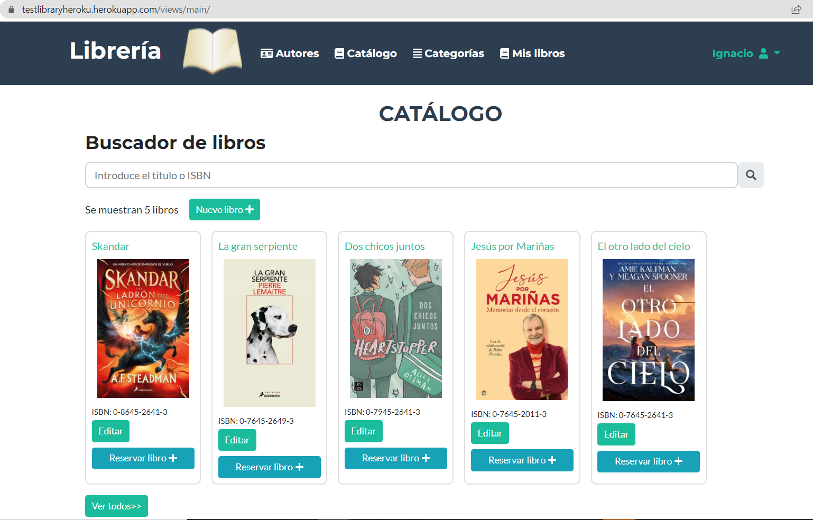

# Documentation for technical user


## DB Connection

Multiple files are working together to form the database connection:
- config.php -> to connect to the database
- controller.php -> controller back and front app, it has common functions

db_structure.sql has the structure of the library application's database.. The tables implemented in database are:
	- author
	- book
	- book_authors -> author assigned to books
	- book_categories -> category assigned to books
	- book_users -> books reservated to users
	- categories
	- user -> to login and user custom app


  The following diagram shows the relations for the different tables.
  

The files and folder detailed in this section are:
  ```
  ├── classes/controller.php
  ├── classes/config.php
  └── sql/db_structure.sql
  ```


## Assets and components view

- Asset folder contains images, stylesheets and scripts js commun (datatables, sweetalert, jquery, moment)
- classes are part of back app with all select, insert, delete and updates data of the Mysql DB scripts in PHP
- header.php imports js and css scripts to use in views
- headebar.php is embedded in all views that are logged in
- footer.php is embedded in all views

The files and folder detailed in this section are:
  ```º
  ├── assets/
  ├── classes/
  ├── views/general/footer.php
  ├── views/general/header.php
  └── views/general/headerbar.php
  ```


## User

This part focuses on the functionality of the user account. 
- The initial view is login.
- You can also create a new user account with another view
- User profile when the user is logged in. You can edit the personal details of the account and update the password.

Some files used in this section are:
  ```
  ├── api/user/checklogin.php
  ├── api/user/create.php
  ├── api/user/login.php
  ├── api/user/logout.php
  ├── api/user/update.php
  ├── classes/user.php
  ├── views/users/profile.php
  └── views/users/registrer.php
  ```


## Modules


### Authors

Authors are displayed in a list. Categories can be edited, deleted and created.

Some files used in this section are:
  ```
  ├── api/author/edit_create.php
  ├── api/author/list_authors.php
  ├── classes/author.php
  ├── views/users/edit_create.php
  └── views/users/index.php
  ```


### Catalog and my books

Books are displayed in a list with a limit of 10 books. You can search by title and ISBN, iin the card of each book in the list you can go to the following views:
- Show book details.
- Create new book.
- Edit the book. You can assign categories and authors to the book.

Some files used in this section are:
  ```
  ├── api/author/list_authors.php -> prepare data from a workbook to create js data tables
  ├── api/book/create_update.php
  ├── api/book/reservate.php
  ├── api/book/assign.php
  ├── api/categories/list_categories.php -> prepare data from a workbook to create js data tables
  ├── classes/book.php
  ├── views/book/edit_create.php
  ├── views/book/view.php
  └── views/main/index.php
  ```

  An example of the catalog is the following
  

### Categories

Categories are displayed in a list. The categories can be edit, delete and create.

Some files used in this section are:
  ```
  ├── api/category/edit_create.php
  ├── api/category/list_all_categories.php -> prepare data from a workbook to create js data tables
  ├── classes/category.php
  ├── views/users/edit_create.php
  └── views/users/index.php
  ```


## Future improvements

There are several improvements to be made in the following versions:
- Password reset email and confirmation to create an account
- Suggest name in catalog search
- Options to filter in catalog
- Add new fields in the book (price, rating, publisher)
- Improved style sheet
- Unit test with PHPUnit
- User manager
